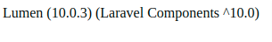
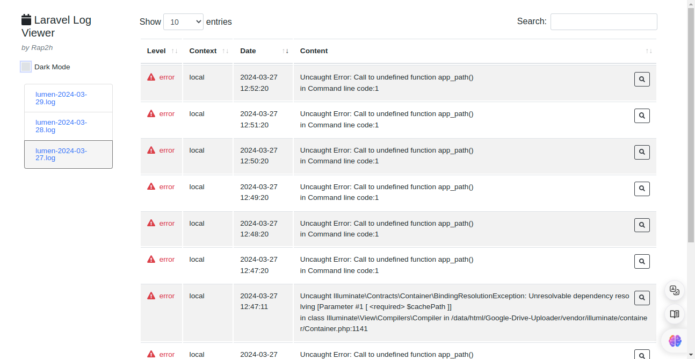
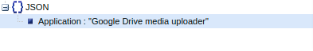

# Google Drive Media Uploader (Public share URLs)
<p align="center">
    <a href="https://in.linkedin.com/in/sagnik-dey-483423a9"  target="_blank"></a>
</p>


<!-- [](https://travis-ci.org/laravel/lumen-framework)
[](https://packagist.org/packages/laravel/lumen-framework)
[](https://packagist.org/packages/laravel/lumen-framework)
[](https://packagist.org/packages/laravel/lumen-framework)


> **Note:** In the years since releasing Lumen, PHP has made a variety of wonderful performance improvements. For this reason, along with the availability of [Laravel Octane](https://laravel.com/docs/octane), we no longer recommend that you begin new projects with Lumen. Instead, we recommend always beginning new projects with [Laravel](https://laravel.com). -->
### Version

## Compatibility
<!-- -  -->
- [PHP (8.0)](https://reintech.io/blog/installing-php-8-on-ubuntu-22)
<!-- -   -->
- [Composer (2.0)](https://getcomposer.org/download)
<!-- -  -->
- [Lumen (10.0)]()
<!-- -  -->
- [Apache or Nginx](https://ubuntu.com/tutorials/install-and-configure-apache#2-installing-apache)
<!-- -   -->
- [Mysql](https://dev.mysql.com/doc/mysql-getting-started/en/)

## Setup & Installation
> Clone the repo
```sh
$ git clone https://github.com/sagnikcapital/Google-Drive-Up-loader.git
```
> Create .env file
```sh
$ cp .env.example .env
```
> Composer install
```sh
$ composer install
```

> Generate Application Key
```sh
$ php -r "echo bin2hex(random_bytes(16));"
```
- Copy the string and paste at `.env` at `APP_KEY` value

> Or, You can generate the App key by using this Custom command
```sh
$ php artisan application:secret
```
- As Lumen does not provide Default key Generate command
> Update the Google Api key at .env (Refer: https://console.cloud.google.com/apis/)
```env
GOOGLE_API_KEY='your-google-api-key'
```
> Generate google client json file and put the file under application/public/Google/ 

> Fill the DB details at .env
```env
DB_CONNECTION=mysql
DB_HOST=127.0.0.1
DB_PORT=3306
DB_DATABASE=''
DB_USERNAME=''
DB_PASSWORD=''
```
```sh
$ php artisan migrate
```
> Add permission to Storage folder
```sh
$ chmod -R 775 storage
```
> Configure .htaccess file
```php
<IfModule mod_rewrite.c>
    RewriteEngine On
    RewriteBase /

    # Redirect to public directory
    RewriteRule ^(.*)$ public/$1 [L]
</IfModule>

# Disable directory listing
Options -Indexes
```
> Run dev server at `8000` port
```sh
$ php -S localhost:8000 -t public
```

### Setup Superviser for Queue Job
```sh
$ sudo apt-get install supervisor
```
```sh
$ sudo systemctl status supervisor
```
> Follow this documentation: https://cloudkul.com/blog/how-to-install-and-configure-supervisor-on-ubuntu-20-04/
### Custom make Job command
```sh
$ php artisan make:job SampleJob
```
> File will be generate at app/Jobs/SampleJob.php
### Custom make Service command
```sh
$ php artisan make:service SampleService
```
> File will be generate at app/Services/SampleService.php

### Clear application cache
```sh
$ php artisan cache:remove
```
### Lumen log viewer

- Refer: https://github.com/rap2hpoutre/laravel-log-viewer (Lumen part)
> Open `/logs`

### Make Custom Commands
```sh
$ php artisan make:command SampleCommand
```
> File will generate at app/Console/Commands/

### Add this Package to Lumen to prevent Http Bridge Error
```sh
$ composer require symfony/psr-http-message-bridge
```
### Create the Queue config file from vendor
```sh
$ cp vendor/laravel/lumen-framework/config/queue.php config/queue.php
```
> After that at `bootstrap/app.php` add this line
```php
$app->configure('queue');
```
```sh
$ php artisan queue:table
```
```sh
$ php artisan queue:failed-table
```
- Refer: https://lumen.laravel.com/docs/10.x/queues
## Create Logging Configuration Files
```sh
$ cp vendor/laravel/lumen-framework/config/logging.php config/logging.php
```
```php
$app->configure('logging');
```
## Install Illuminate Mail for Mailing feature
```sh
$ composer require composer require illuminate/mail:* --with-all-dependencies
```
- [May be differ from Official document](https://lumen.laravel.com/docs/10.x/mail)
```php
$app->configure('mail');
```
## Install Redis for Lumen
```sh
$ composer require illuminate/redis:* --with-all-dependencies
```
> Add this code to `boostrap/app.php`
```php
$app->register(Illuminate\Redis\RedisServiceProvider::class);
```
### Home


### Additional Supported Environment


### SQS Supported


<!-- ### Redis Queue Supported
 -->

## API  Documentation
| API URL                 | Parameters          | Method   |
|-------------------------|---------------------|----------|
| `api/import/media`      | `public url`        | POST     |                    

Public Share URL(Example): 

-------------------------------------------------------------------------
https://www.dropbox.com/scl/fi/d9irp59qqlmfe0nvwcxn6/my-logo-1.mp3?dl=1
-------------------------------------------------------------------------

<!-- ## Contributing

Thank you for considering contributing to Lumen! The contribution guide can be found in the [Laravel documentation](https://laravel.com/docs/contributions). -->

With Best regards,
 ### [Sagnik Dey](https://in.linkedin.com/in/sagnik-dey-483423a9)


## 💻 Tech Stack
                    
       


